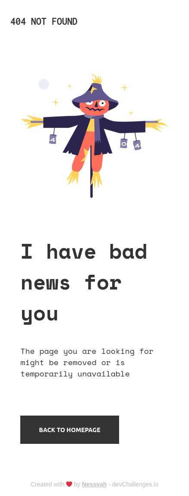
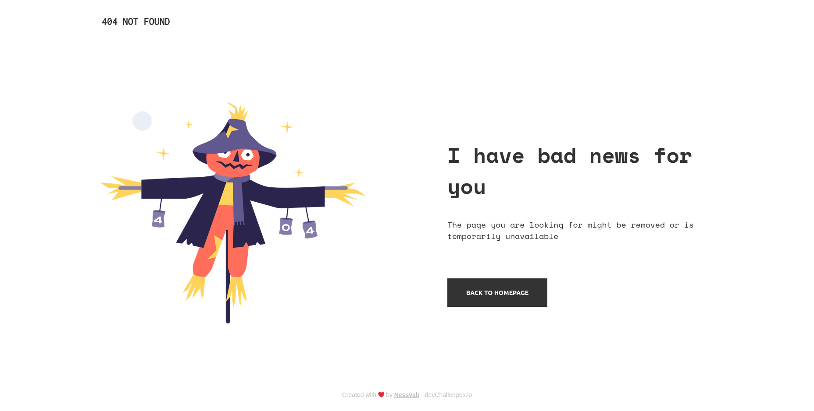

# Page 404 not found

My solution for a challenge from [Devchallenges.io](http://devchallenges.io)

### Demo

[Click Here](https://stupefied-clarke-d49be9.netlify.app/)

### Solution

[Click Here](https://github.com/Nessvah/404-page-challenge)

### Challenge

[Click Here](https://devchallenges.io/challenges/wBunSb7FPrIepJZAg0sY)

<!-- TABLE OF CONTENTS -->

## Table of Contents

- [Page 404 not found](#page-404-not-found)
    - [Demo](#demo)
    - [Solution](#solution)
    - [Challenge](#challenge)
  - [Table of Contents](#table-of-contents)
  - [Overview](#overview)
    - [Built With](#built-with)
  - [Features](#features)
  - [Contact](#contact)

<!-- OVERVIEW -->

## Overview

- Tried to build the webpage with the mobile-first approach but had a hard time fixing the layout once on the bigger screen.
- Had some difficulty in maintaining the footer on the bottom of the viewport.
- Used flexbox to practice.
- Overall and despite some trouble with the layout, I think that the outcome is exactly how it was expected to be.

This webpage was deployed with Netlify.

### Built With

<!-- This section should list any major frameworks that you built your project using. Here are a few examples.-->

- HTML
- CSS
- FIGMA

## Features

<!-- List the features of your application or follow the template. Don't share the figma file here :) -->

This webpage was created as a submission to a [DevChallenges](https://devchallenges.io/challenges) challenge. The [challenge](https://devchallenges.io/challenges/wBunSb7FPrIepJZAg0sY) was to build a webpage to complete the given user stories.

## Contact

- GitHub [@nessvah](https://github.com/Nessvah)
- Twitter [@your-twitter](https://twitter.com/Nessvah_)
